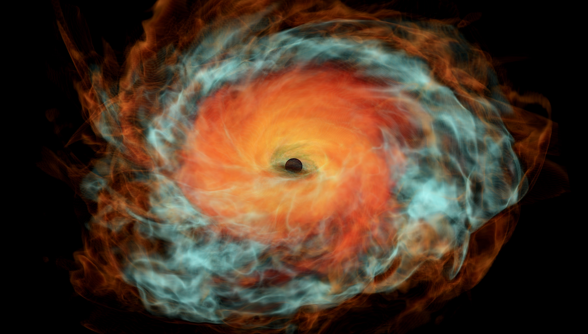

# BH@H Visualization Toolkit




The BH@H Visualization Toolkit provides a foundation for visualizing simulation data produced by the [BlackHoles@Home](https://blackholesathome.net/) project (and others) using Python and [Mayavi](https://docs.enthought.com/mayavi/mayavi/). 

</br>

*NOTE: If you're already familiar with and prefer the visualization software [VisIt](https://visit-dav.github.io/visit-website/index.html), older tools originally used to develop this repository can be found in the [deprecated VisIt branch](https://github.com/tyndalestutz/bh_vis/tree/tyndalestutz/deprecated-visit_tools).*

</br>

[](https://opensource.org/licenses/MIT)  


## Usage

Whether you have your own data or you'd like to tinker with our sample data, simply clone this repository into a new folder and navigate to [the comprehensive step-by-step guide](jupyter_notebooks/Tutorial-Start_to_Finish-Psi4_to_mp4.ipynb) to create your first movie!

If you'd like to skip straight to usage, run the following lines to get started.

#### Windows

```
git clone https://github.com/tyndalestutz/bh_vis.git
cd bh_vis
Python -m venv .venv
.venv/scripts/Activate.ps1
pip install -r requirements.txt
```

#### UNIX/OSX

```
git clone https://github.com/tyndalestutz/bh_vis.git
cd bh_vis
python3 -m venv .venv
source .venv/bin/activate
pip install -r requirements.txt
```

To use these scripts with your own data, take a look at [this brief explanation](jupyter_notebooks/Tutorial-Compatible_Data_Formats.ipynb) of compatible data formats, along with instructions to prepare your data.

## Troubleshooting  `animation_main.py`
Depending on your system, Mayavi might require some adjustments in order to properly render. To fix the Linux graphics issue with `libstdcxx` and `OpenGL` rendering, try installing the dependencies through conda:

```
conda install -c conda-forge libstdcxx-ng
```

## Resources

If you haven't already, check out [(bh@h)](https://blackholesathome.net/blackholesathome_homepage-en_US.html) to volunteer some of your processing power for the simulation of black hole collisions! And in the meantime, further data to be visualized can be found from the following sources:

1. [(Zenodo GW150914)](https://zenodo.org/records/155394)
2. [(SXS Collaboration)](https://data.black-holes.org/waveforms/index.html)
## Contributing

Pull requests are welcome! If you'd like to add or fix anything, follow these steps:

1. Fork the repository to your own GitHub account.
2. `git clone` your forked repository.
3. `git checkout -b <my-branch-name>` to create a branch, replacing with your actual branch name.
4. Add your features or bug fixes.
5. `git push origin <my-branch-name>` to push your branch to your forked repository.
6. Head back to the upstream `tyndalestutz/bh_vis` repository and submit a pull request using your branch from your forked repository.
